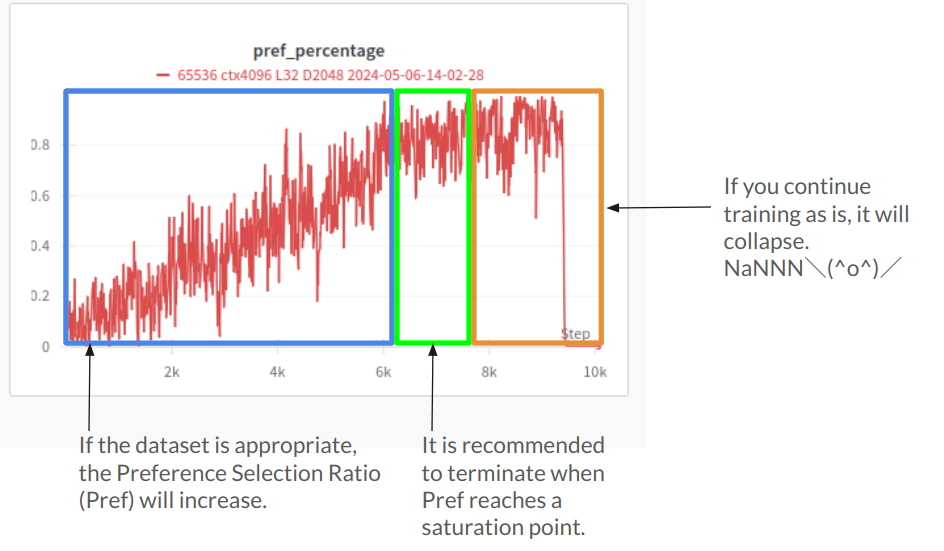

# RWKV-LM-State-4bit

# WARNING: Eternal Debugging, pre-release.
This repo is forked from RWKV-LM

Test implement of RWKV v6 State-tuning with 4-bit quantization

if quant is disabled, it operates in bf16 training mode.
## 2024.05.08 Update
   - Optimized VRAM Management on Orpo Training mode
   - Now, can train L61D4096 14B Orpo in ctx1024 @RTX4090! 


|   Model         | n_layer | dimention  | VRAM ctx1024 |
| --------- | ---- | ---- | ---- |
| RWKV x060-14B | 61 | 4096 | 16.8 GB |
| RWKV x060-7B  | 32 | 4096 | 11.6 GB |
| RWKV x060-3B  | 32 | 2560 | 7.7 GB  |
| RWKV x060-2B  | 32 | 2048 | 7.0 GB  |
## 2024.05.06 Update
1. Implemented Odds Ratio Preference Optimization(Orpo)
   - Orpo adds a penalty based on odds ratio to the usual loss method to tell apart preferred and less preferred response styles.
   - Refined Algorithm from RWKV-LM-LISA's Orpo
   - If you prepare datasets for Chosen and Negative, you can train intensely to provide desirable answers to questions.
   - Support gradient checkpointing. Compared to the old implementation of RWKV-LM-LISA's Orpo, it can reduce VRAM usage by up to 60%.
   - DPO Dataset Compatible


I have quantized the main weights of RWKV to 4 bits using Bitsandbytes and enabled State-Tuning. 

Additionally, I have configured the output checkpoint to only output time-state.

Quantizing to 4 bits can reduce VRAM usage by about 40%.

Ex. L61D4096 x060 14B can train on 24GB GPU!(15.3GB Use)

## This repo works
   - 1. Freeze Main Weight
   - 2. Quantize main weights 4bit via Bitsandbytes
   - 3. train
   - 4. output time_state only
   
## Orpo Usages
1. Prepare Orpo Dataset
   - now only support UTF-8 CSV(keys 'prompt','chosen','reject')
   - if you wanna add reject, 
   - ```python rlhf_generate_reject.py --load_model YOURMODEL --input_csv YOURCSV --output_csv OUTPUTDEST ```
   - Tokenize using RWKV models
   - ```python PrepareOrpoDataset.py --load_model YOURMODEL --input_csv YOURCSV --output_save OUTPUTDEST --target_pair_count 1000 ```
2. Run `train.py`:
   - set --orpo 1 
   - set --orpo_alpha 0.0006 (coefficient while observing the balance between OddsRatio Loss and SFT Loss (e.g., 1:1))
   - set --rlhf_max_corpus_len 600 Maximum Token limit each prompt,chosen,reject for avoid OoM
   - set --rlhf_train_file 'YOUR TOKENIZED DATA FILENAME'
   
## Extra
   - if RWKV x060 7b or 14b, set --double_extra_dim 1


## SFT 4bit training
My training command is provided as follows:
```
python train.py --load_model "base_model/rwkv-16.pth"\
 --load_partial 1 \
 --wandb "RWKV-LM State-tuning" --proj_dir "1B6-State-Tuning"\
 --data_file "dataset/dataset" --train_type "states"\
 --data_type "binidx" --vocab_size 65536 --ctx_len 4096 \
 --epoch_steps 1000 --epoch_count 1000 --epoch_begin 0 --epoch_save 1 \
 --micro_bsz 1 --n_layer 24 --n_embd 2048 \
 --lr_init 1 --lr_final 0.01 \
 --warmup_steps 10 --beta1 0.9 --beta2 0.999 --adam_eps 1e-8 \
 --accelerator gpu --devices 1 --precision bf16 \
 --grad_cp 1 --my_testing "x060" \
 --strategy deepspeed_stage_1 \
 --quant 1 \
 --quant_type 'nf4' \
 --double_extra_dim 0
```


## Orpo 4bit training
My training command is provided as follows:
```
python train.py --load_model "base_model/Anarchy-RWKV-2B-68.pth"\
 --wandb "RWKV-LM-State-4bit Orpo 2B" --proj_dir "2BStateOrpo12" \
 --data_file "default_text_document" --train_type "states" \
 --data_type "binidx" --vocab_size 65536 --ctx_len 4096 \
 --epoch_steps 1000 --epoch_count 1000 --epoch_begin 0 --epoch_save 1 \
 --micro_bsz 1 --n_layer 32 --n_embd 2048 --weight_decay 0.000 \
 --lr_init 1 --lr_final 0.01 \
 --warmup_steps 100 --beta1 0.9 --beta2 0.999 --adam_eps 1e-8 \
 --accelerator gpu --devices 1 --precision bf16 \
 --grad_cp 1 --my_testing "x060" \
 --strategy deepspeed_stage_1 \
 --quant 1 \
 --quant_type 'nf4' \
 --double_extra_dim 0 \
 --orpo 1 \
 --orpo_alpha 0.0006 \
 --rlhf_max_corpus_len 1024 \
 --orpo_debug 0 \
 --orpo_type 0 \
 --rlhf_train_file orpotest.save \
```
## Merge to Base model
```
python merge_state.py <base_model.pth> <state_checkpoint.pth> <output.pth>
```


# And Thanks to:
   - RWKV-LM @BlinkDL
   - RWKV-LM-RLHF-DPO @Triang-jyed-driung
   - RWKV-PEFT @JL-er
   - Orpo @xfactlab


# License
same with RWKV-LM

Apache 2.0


@ 2024 OpenMOSE
